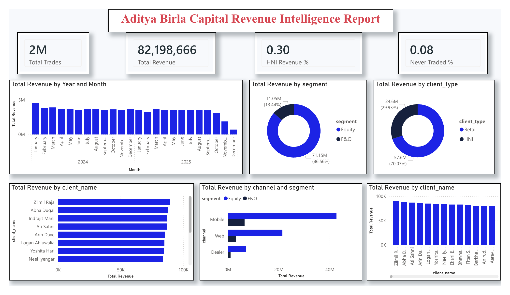

<h1 align="center"> Sri Shreya Danda (GaaGa)</h1>

<p align="center">
  <b>Data Analyst & Business Analyst</b><br/>
  SQL • Python • Power BI • Financial & Business Analytics
</p>

<p align="center">
  🎓 MS Artificial Intelligence & Business Analytics @ USF  
  📍 Tampa, FL | 💼 Open to Opportunities | 📅 Available June 2026
</p>

<p align="center">
  <a href="https://www.linkedin.com/in/srishreya-danda-2b27141a2/">
    
  </a>
  <a href="mailto:danda108@usf.edu">
    
  </a>
</p>

---

## 🌐 Live Portfolio
🔗 https://dandasrishreya.in 

---

## 🧾 About This Portfolio

A modern, production-grade portfolio built to showcase real-world data analytics work, business impact, and decision-making capabilities.

Designed with a focus on:
- Clean UI & performance
- Strong storytelling through data
- Real business use-cases (not academic demos)

---

## 🚀 Tech Stack

### 📊 Data & Analytics


### 🐍 Programming


### ⚙️ Tools & Platforms


---

## 📊 Key Highlights

- 📈 Improved operational efficiency by **35%** through data-driven insights  
- ⚡ Reduced issue resolution time by **22%** via root cause analysis  
- 🔄 Automated reporting workflows, cutting manual effort by **30%**  
- 🧠 Built dashboards translating complex data into executive-level insights  

---

## 📁 Featured Project

### 🏦 Trading & Brokerage Revenue Intelligence System

A real-world financial analytics system designed to analyze:

- Revenue sources and trading patterns  
- High-value customer segments  
- Dormant accounts and retention strategies  
- Operational inefficiencies affecting business growth  

#### 🔍 Key Contributions:
- Built SQL-based data models for transactional analytics  
- Developed Power BI dashboards for business decision-making  
- Performed cohort analysis and revenue segmentation  
- Delivered actionable insights to improve trading activity  

<p align="center">
  
</p>

---

## 📂 Project Structure

```bash
app/
components/
public/
  images/
  screenshots/
  resume/
```

##Get started

# Clone the repository
git clone https://github.com/shreya180720/portfolio-shreya-gagana-s.git

# Navigate into the project
cd portfolio-shreya-gagana-s

# Install dependencies
npm install

# Run development server
npm run dev

---
###Contact

📧 danda108@usf.edu
🔗 https://www.linkedin.com/in/srishreya-danda-2b27141a2/
